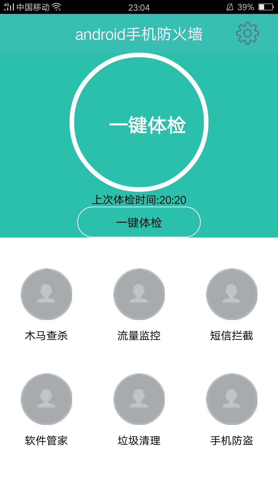
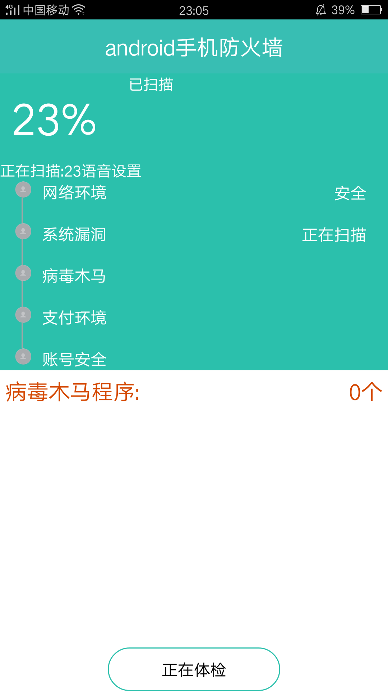
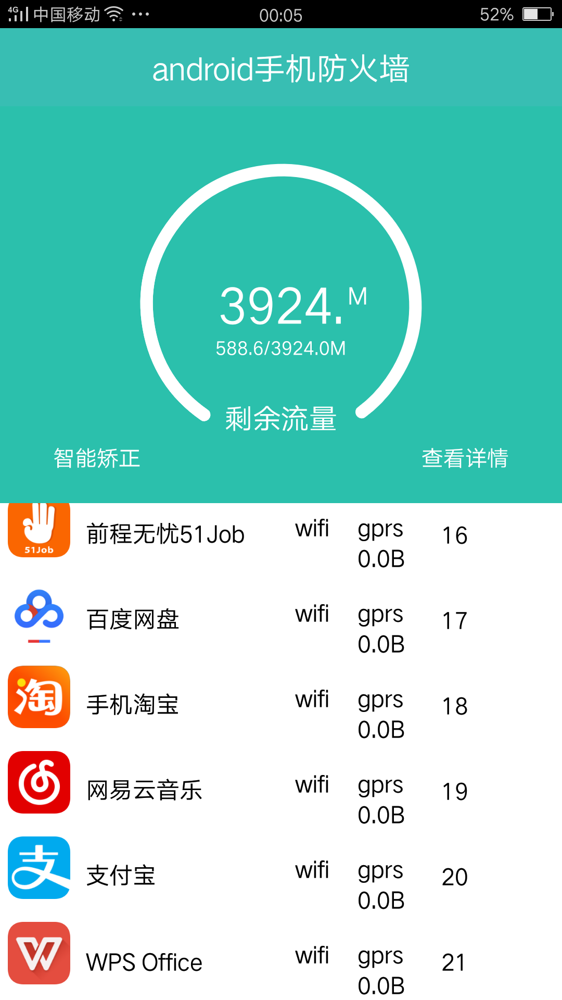
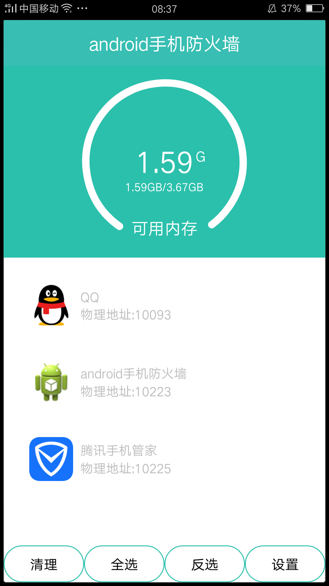
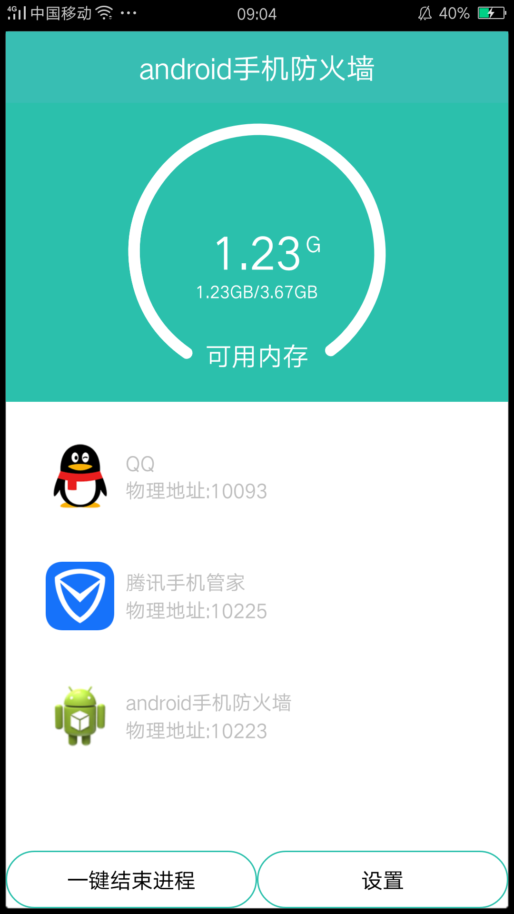

# afhq
本项目是作者的大学毕业设计，获得2017届计算机科学与技术学院的优秀毕业设计。其功能实用，界面美观，设计合理，技术点丰富。后期将进行更新，融入木马在线数据库，优化各种机型适配。类似于腾讯手机管家，360安全卫士等软件系。
# 主要功能：
系统设计包括木马查杀，流量监控，通过iptable配置过滤规则，短信电话拦截，提升在5.0以上的系统，利用内容提供者监听系统短信数据库的变化和本地数据库的变化判断是否在黑名单中。进程管理，管理后天运行进程，垃圾扫描，扫描系统中的垃圾文件，目前只是扫描垃圾文件并清理，后期维护将扫描文件系统，和缓存系统。手机防盗在利用任务栈的模式管理手机应用程序。系统中主要用到的技术有很多，有java高级知识，Android高级知识，也有基础知识，有自定义控件的使用，有不同布局和配合，有很多东西值得一看的。
## 功能设计
### 主页面
主页面包括自定义进度条和九宫格，帧布局的切换。

    

### 木马查杀
木马查杀主要是通过病毒数据库以及linux对端口的监控实现漏洞扫描以及木马扫描，通过文件类型数据库管理文件是否为绑定文件。

    

### 网络监控
采用iptable的linux的规则，配置规则，使得在wifi情况下可以使用网络，在GPRS情况下可以不使用网络。

    

### 短信拦截
采用黑名单数据库和内容提供者模式进行监听短信和电话到来广播，若是黑名单中的电话号码，利用反射原理进行删除和挂掉电话。

    

### 垃圾清理
采用linux缓存的原则，将缓存中无用的数据进行清查，将浏览痕迹进行清查，将大文件，列出来选择清查。将app缓存的无用文件清查。垃圾清查、

    

### 软件管理
采用枷锁密码模式进行软件管理，采用系统提供的任务栈模式，实现在打开另外的app是进行枷锁判断。

    

### 添加Android studio 配置

# 详细介绍博客地址：
http://blog.csdn.net/baidu_23086307/article/category/6209559
# 作者：
qq：1029718215
wx：twjitm
群 239545950
